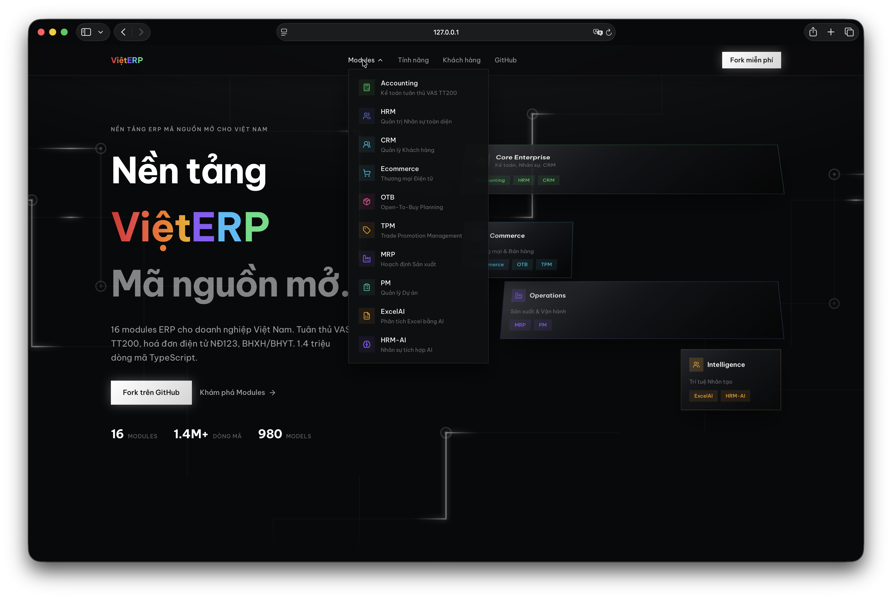
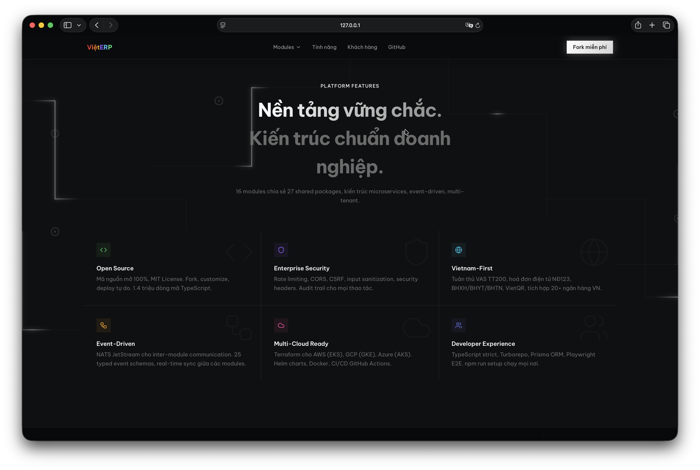
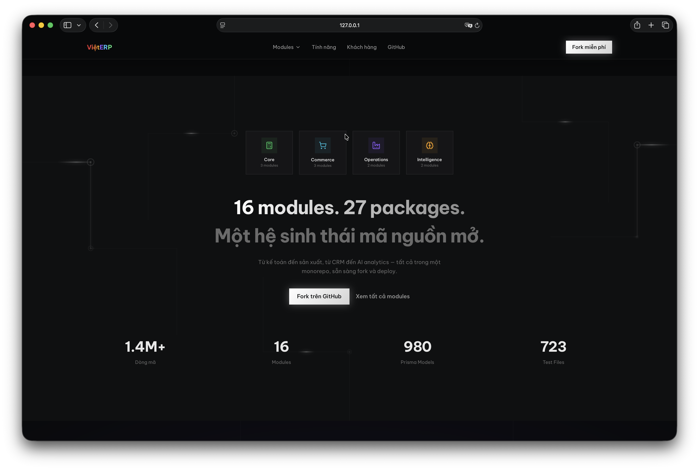

# VietERP Platform

**Nền tảng ERP mã nguồn mở cho doanh nghiệp Việt Nam / Open-source ERP platform for Vietnamese enterprises**

[](https://github.com/nclamvn/Viet-ERP/actions/workflows/ci.yml)
[](./LICENSE)
[](https://www.typescriptlang.org/)
[](https://nextjs.org/)
[](https://www.postgresql.org/)

VietERP Platform là hệ sinh thái ERP toàn diện, đạt chuẩn doanh nghiệp, được xây dựng bằng công nghệ web hiện đại. Thiết kế riêng cho thị trường Việt Nam với tuân thủ kế toán VAS (TT200), hoá đơn điện tử NĐ123, bảo hiểm xã hội, và giao diện song ngữ Việt-Anh.

VietERP Platform is a comprehensive, enterprise-grade ERP ecosystem built with modern web technologies. Designed specifically for the Vietnamese market with VAS accounting compliance (TT200), e-Invoice (NĐ123), social insurance, and bilingual Vi-En interface.

### Screenshots







## Quy mô dự án / Project Scale

| Chỉ số / Metric | Giá trị / Value |
|--------|-------|
| Tổng dòng mã / Total LOC | **1,431,780** (by `cloc`, excl. blanks + comments) |
| Ứng dụng / Applications | 16 modules |
| Gói chia sẻ / Shared Packages | 27 (`@vierp/*`) |
| Prisma Models | 980 |
| API Routes | 1,322 |
| Test/Spec Files | 723 (157 E2E specs) |
| Dockerfiles | 17 |
| Terraform Files | 29 (AWS + GCP + Azure) |
| Grafana Dashboards | 8 |
| CI/CD Workflows | 3 (ci, release, deploy) |
| Tổng tệp / Total Files | 9,012 |

### Phân bổ mã nguồn / Code Breakdown

Đếm bằng [`cloc`](https://github.com/AlDanial/cloc) — loại blank lines + comments.

| Ngôn ngữ / Language | Code LOC | Files | Ghi chú |
|---|---|---|---|
| TypeScript (.ts/.tsx) | 1,058,429 | 6,250 | Backend + Frontend |
| JSON Config | 162,412 | 156 | Package configs + Helm |
| Markdown Docs | 88,914 | 270 | ADRs + guides + API refs |
| CSS / Tailwind | 36,695 | 56 | Styles |
| Prisma Schema | 26,009 | 14 | 980 models |
| YAML Config | 16,036 | 76 | CI/CD + monitoring |
| JavaScript (.js/.jsx) | 20,309 | 110 | Config + scripts |
| SQL Migrations | 9,584 | 43 | Database migrations |
| Terraform (.tf) | 4,270 | 29 | AWS + GCP + Azure |
| Shell Scripts | 2,843 | 26 | DevOps + automation |

## Độ hoàn thiện / Completion Status

```
Tổng thể / Overall:  █████████████████████  100%
```

| Lĩnh vực / Area | Trạng thái | Chi tiết |
|---|---|---|
| Core Modules (15 apps) | ✅ Hoàn thiện | HRM, CRM, MRP, Accounting, Ecommerce, OTB, TPM, PM, ExcelAI, Docs, Landing Page |
| Shared Packages (27) | ✅ Hoàn thiện | auth, events, metrics, openapi, search, audit, notifications, dashboard, vietnam, rate-limit, security... |
| CI/CD Pipeline | ✅ Hoàn thiện | 7-job pipeline: lint, typecheck, test, build, coverage, security-audit, docker-build |
| Testing | ✅ Hoàn thiện | 154 E2E specs (Playwright), Vitest unit tests, coverage reporting |
| Docker | ✅ Hoàn thiện | 17 Dockerfiles, docker-compose.prod.yml, multi-stage builds |
| Kubernetes | ✅ Hoàn thiện | Helm chart, HPA, Ingress TLS, ConfigMaps, staging/production values |
| Terraform IaC | ✅ Hoàn thiện | AWS (EKS+RDS), GCP (GKE+CloudSQL), Azure (AKS+PostgreSQL) |
| Monitoring | ✅ Hoàn thiện | Prometheus + Grafana (6 dashboards) + Loki + alerting rules |
| Security | ✅ Hoàn thiện | Rate limiting, CORS, CSRF, security headers, input sanitization |
| Vietnamese Market | ✅ Hoàn thiện | VAT/PIT/CIT, e-Invoice NĐ123, BHXH/BHYT/BHTN, VietQR, 20 banks |
| Documentation | ✅ Hoàn thiện | 10 ADRs, 5 architecture diagrams, 5 developer guides, 5 API refs, DB schema docs |
| Community | ✅ Hoàn thiện | CONTRIBUTING, SECURITY, CHANGELOG, issue/PR/discussion templates |

## Các module / Modules

| Module | Mô tả / Description | Port | Framework |
|--------|-------------|------|-----------|
| **Accounting** | Kế toán (tuân thủ TT200) / Accounting (TT200 compliant) | 3007 | Next.js |
| **CRM** | Quản lý khách hàng / Customer Relationship Management | 3018 | Next.js |
| **Ecommerce** | Thương mại điện tử / E-Commerce platform | 3008 | Next.js |
| **HRM** | Quản lý nhân sự / Human Resource Management | 3001 | Next.js |
| **HRM-AI** | Nhân sự tích hợp AI / AI-powered HRM | 3002 | Next.js |
| **HRM-Unified** | Nhân sự hợp nhất / Unified HRM | 3003 | Next.js |
| **MRP** | Quản lý sản xuất / Manufacturing Resource Planning | 3005 | Next.js |
| **OTB** | Kế hoạch mua hàng / Open-To-Buy Planning | 3009 | Next.js |
| **TPM-API** | TPM Backend | — | Vercel |
| **TPM-API-NestJS** | TPM Backend (NestJS) | 3010 | NestJS |
| **TPM-Web** | TPM Frontend | 5180 | Vite |
| **TravelOps** | Travel agency and tour operator operations | TBD | Prisma/TypeScript |
| **PM** | Quản lý dự án / Project Management | 5173 | Vite |
| **ExcelAI** | Phân tích Excel bằng AI / AI-powered Excel Analysis | 5173 | Vite |
| **Docs** | Tài liệu / Documentation portal | 3011 | Next.js |
| **Landing Page** | Trang giới thiệu / Marketing landing page | 3012 | Next.js |
| **Liphoco** | ERP cho Liphoco / Liphoco ERP module | 3020 | Next.js |

## Shared Packages (27)

| Package | Mô tả / Description |
|---------|-------------|
| `@vierp/auth` | Xác thực Keycloak SSO + RBAC |
| `@vierp/events` | NATS JetStream event bus + 25 typed schemas + inter-module flows |
| `@vierp/metrics` | Prometheus metrics (HTTP, DB, NATS, cache) |
| `@vierp/openapi` | OpenAPI 3.1 spec + Swagger UI |
| `@vierp/search` | Meilisearch integration — federated cross-module search |
| `@vierp/audit` | Audit trail — Prisma middleware, deep diff, query helpers |
| `@vierp/notifications` | WebSocket notification center + Redis store |
| `@vierp/dashboard` | Unified dashboard — KPI cards, charts, 3 presets |
| `@vierp/vietnam` | Vietnamese market: VAT/PIT/CIT, e-Invoice, BHXH, VietQR |
| `@vierp/rate-limit` | Redis-backed rate limiting (sliding window + token bucket) |
| `@vierp/security` | Security headers, CORS, CSRF, input sanitization |
| `@vierp/database` | Prisma client + connection management |
| `@vierp/cache` | Redis caching utilities |
| `@vierp/logger` | Structured logging (Pino) |
| `@vierp/health` | Health check endpoints |
| `@vierp/i18n` | Internationalization (Vi-En) |
| `@vierp/branding` | White-label branding config |
| `@vierp/saas` | Multi-tenant SaaS utilities |
| `@vierp/ai-copilot` | AI integration (Anthropic/OpenAI) |
| `@vierp/feature-flags` | Feature flag management |
| `@vierp/errors` | Standardized error handling |
| `@vierp/api-middleware` | API middleware chain |
| `@vierp/master-data` | Master data management |
| `@vierp/sdk` | Platform SDK |
| `@vierp/admin` | Admin utilities |
| `@vierp/shared` | Common utilities |
| `@vierp/tpm-shared` | TPM shared types |

## Công nghệ / Tech Stack

| Layer | Công nghệ / Technology |
|-------|----------------------|
| **Frontend** | Next.js 14, React 18, TypeScript 5, Tailwind CSS |
| **Backend** | Next.js API Routes, NestJS, Prisma ORM |
| **Database** | PostgreSQL 16 (971 models, multi-schema) |
| **Messaging** | NATS JetStream (event-driven architecture) |
| **Auth** | Keycloak SSO + RBAC |
| **Gateway** | Kong API Gateway |
| **Cache** | Redis 7 |
| **Search** | Meilisearch (Vietnamese-optimized) |
| **Monitoring** | Prometheus + Grafana + Loki |
| **Build** | Turborepo + npm workspaces |
| **Testing** | Vitest + Playwright |
| **CI/CD** | GitHub Actions (7-job pipeline) |
| **Container** | Docker (17 multi-stage Dockerfiles) |
| **Orchestration** | Kubernetes + Helm |
| **IaC** | Terraform (AWS, GCP, Azure) |

## Bắt đầu nhanh / Quick Start

> Hoạt động trên **Windows**, **macOS**, và **Linux** — không cần cài `make` hay bash.
>
> Works on **Windows**, **macOS**, and **Linux** — no `make` or bash required.

### Cách 1: Một lệnh duy nhất / One command setup

```bash
git clone https://github.com/nclamvn/Viet-ERP.git
cd Viet-ERP
npm run setup     # Cài đặt + Docker + migrate + seed (cross-platform)
npm run dev       # Khởi động development
```

### Cách 2: Thủ công / Manual setup

```bash
# Clone
git clone https://github.com/nclamvn/Viet-ERP.git
cd Viet-ERP

# Cài đặt thư viện / Install dependencies
npm install --legacy-peer-deps

# Khởi động hạ tầng / Start infrastructure
npm run docker:up
# hoặc / or: docker compose up -d

# Thiết lập môi trường / Setup environment
#   macOS/Linux:
cp .env.example .env
#   Windows (PowerShell):
#   Copy-Item .env.example .env

# Database migrations
npm run db:migrate
npm run db:seed

# Khởi động / Start development
npm run dev
```

### Lệnh thường dùng / Common Commands

| Lệnh / Command | Mô tả / Description |
|---|---|
| `npm run setup` | Setup toàn bộ / Full setup (cross-platform) |
| `npm run dev` | Dev server |
| `npm run build` | Build all modules |
| `npm test` | Run tests |
| `npm run test:e2e` | Run E2E tests |
| `npm run lint` | Lint code |
| `npm run clean` | Remove build artifacts |
| `npm run docker:up` | Start Docker services |
| `npm run docker:down` | Stop Docker services |
| `npm run db:migrate` | Run database migrations |

> **macOS/Linux**: `make` commands cũng hoạt động (`make dev`, `make setup`). Xem `make help`.

### Cách 3: Docker Compose Production

```bash
cp .env.production.example .env
docker compose -f docker-compose.prod.yml up -d
```

### Makefile Commands

```bash
make setup       # Thiết lập môi trường
make dev         # Chạy development servers
make test        # Chạy tất cả tests
make test-e2e    # Chạy E2E tests
make build       # Build toàn bộ
make lint        # Kiểm tra lint + typecheck
make clean       # Dọn dẹp
make docker-up   # Khởi động Docker
make docker-down # Tắt Docker
make db-migrate  # Chạy migrations
make db-seed     # Tạo dữ liệu mẫu
make help        # Xem tất cả lệnh
```

## Cấu trúc dự án / Project Structure

```
Viet-ERP/
├── apps/                          # 14 ứng dụng / Application modules
│   ├── Accounting/                # Kế toán (TT200)
│   ├── CRM/                       # Khách hàng
│   ├── Ecommerce/                 # Thương mại điện tử
│   ├── ExcelAI/                   # Phân tích Excel AI
│   ├── HRM/                       # Nhân sự
│   ├── HRM-AI/                    # Nhân sự + AI
│   ├── HRM-unified/               # Nhân sự hợp nhất
│   ├── MRP/                       # Sản xuất
│   ├── OTB/                       # Kế hoạch mua hàng
│   ├── PM/                        # Quản lý dự án
│   ├── TPM-api/                   # TPM Backend
│   ├── TPM-api-nestjs/            # TPM Backend (NestJS)
│   ├── TPM-web/                   # TPM Frontend
│   └── docs/                      # Tài liệu
├── packages/                      # 27 gói chia sẻ / Shared packages
│   ├── audit/                     # Audit trail
│   ├── auth/                      # Xác thực Keycloak
│   ├── dashboard/                 # Unified dashboard
│   ├── events/                    # NATS event bus
│   ├── metrics/                   # Prometheus metrics
│   ├── notifications/             # WebSocket notifications
│   ├── openapi/                   # OpenAPI specs
│   ├── rate-limit/                # Rate limiting
│   ├── search/                    # Meilisearch
│   ├── security/                  # Security headers + CORS
│   ├── vietnam/                   # Vietnamese market compliance
│   └── ...                        # 16 gói khác
├── infrastructure/                # Hạ tầng / Infrastructure
│   ├── monitoring/                # Prometheus + Grafana + Loki
│   ├── search/                    # Meilisearch
│   └── terraform/                 # IaC (AWS, GCP, Azure)
├── charts/vierp/                  # Helm chart cho Kubernetes
├── docs/                          # Tài liệu chi tiết
│   ├── adr/                       # 10 Architecture Decision Records
│   ├── architecture/              # 5 Mermaid diagrams
│   ├── guides/                    # 5 Developer guides
│   ├── api/                       # 6 API reference docs
│   └── database/                  # Database schema docs
├── .github/                       # CI/CD + templates
│   └── workflows/                 # ci.yml, release.yml
├── docker-compose.yml             # Development infrastructure
├── docker-compose.prod.yml        # Production deployment
├── Makefile                       # Developer commands
├── turbo.json                     # Turborepo config
├── CHANGELOG.md                   # Lịch sử thay đổi
├── CONTRIBUTING.md                # Hướng dẫn đóng góp
├── SECURITY.md                    # Chính sách bảo mật
├── CODE_OF_CONDUCT.md             # Quy tắc ứng xử
└── LICENSE                        # Giấy phép MIT
```

## Tính năng thị trường Việt Nam / Vietnamese Market Features

| Tính năng | Chi tiết |
|-----------|---------|
| Kế toán VAS (TT200) | Hệ thống tài khoản chuẩn TT200, sổ nhật ký, báo cáo tài chính |
| Hoá đơn điện tử (NĐ123) | Kết nối VNPT, Viettel, FPT, BKAV — tạo, huỷ, thay thế hoá đơn |
| Thuế GTGT | Tính thuế 0%, 5%, 8%, 10% theo Nghị định 44/2023 |
| Thuế TNCN | 7 bậc luỹ tiến (5%–35%), giảm trừ bản thân + người phụ thuộc |
| Thuế TNDN | 20% chuẩn, ưu đãi SME 10%, startup 5% |
| Bảo hiểm xã hội | BHXH (8%+17.5%), BHYT (1.5%+3%), BHTN (1%+1%) |
| VietQR | Tạo/đọc mã QR thanh toán theo chuẩn NAPAS |
| Ngân hàng | 20 ngân hàng Việt Nam (VCB, BIDV, TCB, MB...) |
| Cổng thanh toán | VNPay, MoMo, ZaloPay |
| Vận chuyển | GHN, GHTK, Viettel Post |
| Song ngữ | Giao diện Việt-Anh (tuỳ chỉnh được) |
| Tiền tệ | Format "1.234.567 ₫", chuyển số thành chữ tiếng Việt |

## Monitoring & Observability

VietERP đi kèm bộ monitoring production-ready:

- **Prometheus**: Thu thập metrics từ tất cả 14 apps (HTTP latency, error rates, DB queries)
- **Grafana**: 6 dashboards (Overview, Per-App, Database, NATS, Business KPIs, Alerts)
- **Loki**: Log aggregation từ tất cả containers
- **Alerting**: 8 rules (HighErrorRate, HighLatency, AppDown, HighMemory, PostgreSQLDown, RedisDown, NATSDown, DiskUsage)

```bash
# Khởi động monitoring stack
docker compose -f infrastructure/monitoring/docker-compose.monitoring.yml up -d
# Grafana: http://localhost:3000 (admin/admin)
```

## Deployment

| Môi trường | Công cụ | Hướng dẫn |
|-----------|---------|-----------|
| Development | Docker Compose | `make docker-up && make dev` |
| Production | Docker Compose | `docker-compose.prod.yml` |
| Kubernetes | Helm | `helm install vierp ./charts/vierp -f values-production.yaml` |
| AWS | Terraform + EKS | `infrastructure/terraform/aws/` |
| GCP | Terraform + GKE | `infrastructure/terraform/gcp/` |
| Azure | Terraform + AKS | `infrastructure/terraform/azure/` |

Xem [docs/guides/deployment.md](./docs/guides/deployment.md) để biết chi tiết.

## Tài liệu / Documentation

| Tài liệu | Nội dung |
|-----------|---------|
| [Architecture Decision Records](./docs/adr/) | 10 ADRs giải thích quyết định kiến trúc |
| [Architecture Diagrams](./docs/architecture/) | 5 Mermaid diagrams (system, modules, data flow, deployment, events) |
| [Getting Started](./docs/guides/getting-started.md) | Hướng dẫn bắt đầu |
| [Module Development](./docs/guides/module-development.md) | Hướng dẫn phát triển module mới |
| [Testing Guide](./docs/guides/testing.md) | Hướng dẫn testing |
| [Deployment Guide](./docs/guides/deployment.md) | Hướng dẫn triển khai |
| [Contributing Guide](./docs/guides/contributing.md) | Hướng dẫn đóng góp |
| [API Reference](./docs/api/) | Tài liệu API cho tất cả modules |
| [Database Schema](./docs/database/) | Schema docs + ER diagrams |
| [CHANGELOG](./CHANGELOG.md) | Lịch sử thay đổi |

## Cá nhân hoá thương hiệu / White-Label

VietERP được thiết kế để dễ dàng cá nhân hoá thương hiệu:

```bash
# 1. Sửa cấu hình thương hiệu
# Chỉnh sửa packages/branding/src/config.ts

# 2. Chạy script tái thương hiệu tự động
npx ts-node scripts/rebrand.ts --dry-run   # Xem trước / Preview
npx ts-node scripts/rebrand.ts             # Áp dụng / Apply

# 3. Build lại toàn bộ
npx turbo build
```

Xem [BRANDING.md](./BRANDING.md) để biết chi tiết.

## Đóng góp / Contributing

Chúng tôi hoan nghênh mọi đóng góp! Xem [CONTRIBUTING.md](./CONTRIBUTING.md) để biết hướng dẫn.

```bash
# Quy trình đóng góp
git checkout -b feature/your-feature
# ... code ...
git commit -m "feat: add your feature"
git push origin feature/your-feature
# Tạo Pull Request trên GitHub
```

## Bảo mật / Security

Để báo cáo lỗ hổng bảo mật, vui lòng xem [SECURITY.md](./SECURITY.md).

## Giấy phép / License

Dự án này được cấp phép theo giấy phép MIT. Xem [LICENSE](./LICENSE) để biết chi tiết.

---

Được xây dựng với tâm huyết cho doanh nghiệp Việt Nam.
Built with care for Vietnamese enterprises.
